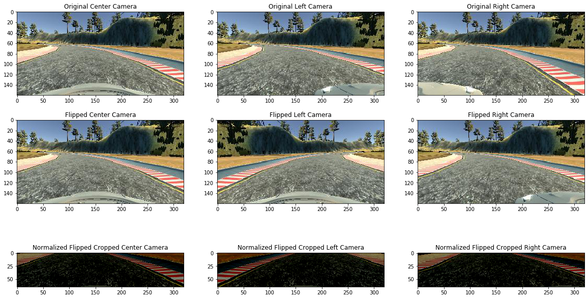

# **Behavioral Cloning**

**Behavioral Cloning Project**

The goals / steps of this project are the following:
* Use the simulator to collect data of good driving behavior
* Build, a convolution neural network in Keras that predicts steering angles from images
* Train and validate the model with a training and validation set
* Test that the model successfully drives around track one without leaving the road
* Summarize the results with a written report


[//]: # (Image References)

[image1]: ./examples/placeholder.png "Model Visualization"
[image2]: ./examples/placeholder.png "Grayscaling"
[image3]: ./examples/placeholder_small.png "Recovery Image"
[image4]: ./examples/placeholder_small.png "Recovery Image"
[image5]: ./examples/placeholder_small.png "Recovery Image"
[image6]: ./examples/placeholder_small.png "Normal Image"
[image7]: ./examples/placeholder_small.png "Flipped Image"
---
### Files Submitted & Code Quality

#### 1. Submission includes all required files and can be used to run the simulator in autonomous mode

My project includes the following files:
* model.py containing the script to create and train the model
* drive.py for driving the car in autonomous mode
* model.h5 containing a trained convolution neural network
* writeup_report.md or writeup_report.pdf summarizing the results

#### 2. Submission includes functional code
Using the Udacity provided simulator and my drive.py file, the car can be driven autonomously around the track by executing
```sh
python drive.py model.h5
```

#### 3. Submission code is usable and readable

The model.py file contains the code for training and saving the, Lenet-5 convolution neural network. Although Lenet-5 was used for traffic sign classifying, it can still be applied to Behavioral Driving. Instead of classifying into different classes, we turn it in a regression case and relate a track image to a steering angle. The resulting model will predict a steering angle for the a particular image.

The model.py shows the pipeline I used for training and validating the model, and it contains comments to explain how the code works.

The pipeline uses augmented side camera images and augmented measurements to assist in steering the car.  

### Model Architecture and Training Strategy

#### 1. An appropriate model architecture has been employed

My model consists of a convolution neural network with 5x5 filter sizes and depths between 6 and 16 (model.py lines 67 and 73)

The model includes RELU layers to introduce nonlinearity (code lines 67 and 73), and the data is normalized in the model using a Keras lambda layer (code line 61). Cropping2D was used to crop the top and bottom of the image. (code line 64)

#### 2. Attempts to reduce overfitting in the model

The model contains dropout layer in order to reduce overfitting (model.py lines 85).

The model was tested by running it through the simulator and ensuring that the vehicle could stay on the track.

#### 3. Model parameter tuning

The model used an adam optimizer, so the learning rate was not tuned manually (model.py line 25).

#### 4. Appropriate training data

Training data was chosen to keep the vehicle driving on the road. I used a combination of center lane driving and using the side camera images. Correction factor was added to the steering measu

For details about how I created the training data, see the next section.

### Model Architecture and Training Strategy

#### 1. Solution Design Approach

The overall strategy for deriving a model architecture was to ...

My first step was to use a convolution neural network model similar to the ... I thought this model might be appropriate because ...

In order to gauge how well the model was working, I split my image and steering angle data into a training and validation set. I found that my first model had a low mean squared error on the training set but a high mean squared error on the validation set. This implied that the model was overfitting.

The final step was to run the simulator to see how well the car was driving around track one. There were a few spots where the vehicle fell off the track... to improve the driving behavior in these cases, I ....

At the end of the process, the vehicle is able to drive autonomously around the track without leaving the road.

#### 2. Final Model Architecture

The final model architecture (model.py lines 18-24) consisted of a convolution neural network with the following layers and layer sizes ...

Here is a model.summary() of the architecture

_________________________________________________________________
|Layer (type)         |        Output Shape         |     Param #  |
|:=====================:|:============================================:|
lambda_1 (Lambda)            (None, 160, 320, 3)       0         
_________________________________________________________________
cropping2d_1 (Cropping2D)    (None, 65, 320, 3)        0         
_________________________________________________________________
conv2d_1 (Conv2D)            (None, 61, 316, 6)        456       
_________________________________________________________________
max_pooling2d_1 (MaxPooling2 (None, 30, 158, 6)        0         
_________________________________________________________________
conv2d_2 (Conv2D)            (None, 26, 154, 16)       2416      
_________________________________________________________________
max_pooling2d_2 (MaxPooling2 (None, 13, 77, 16)        0         
_________________________________________________________________
flatten_1 (Flatten)          (None, 16016)             0         
_________________________________________________________________
dense_1 (Dense)              (None, 120)               1922040   
_________________________________________________________________
dropout_1 (Dropout)          (None, 120)               0         
_________________________________________________________________
dense_2 (Dense)              (None, 64)                7744      
_________________________________________________________________
dense_3 (Dense)              (None, 1)                 65        
=================================================================
Total params: 1,932,721
Trainable params: 1,932,721
Non-trainable params: 0

#### 3. Creation of the Training Set & Training Process

To capture good driving behavior, I first recorded one and quarter laps on track one using center lane driving.

To augment the data set, I also flipped images, normalized, cropped image and added correction factor to steering angle to promote center lane driving. The last row images are examples of inputs into the model.



I finally randomly shuffled the data set and put 20% of the data into a validation set.

I used this training data for training the model. The validation set helped determine if the model was over or under fitting. The ideal number of epochs was 3 as evidenced by loss being steady after third epoch.  I used an adam optimizer so that manually training the learning rate wasn't necessary.
